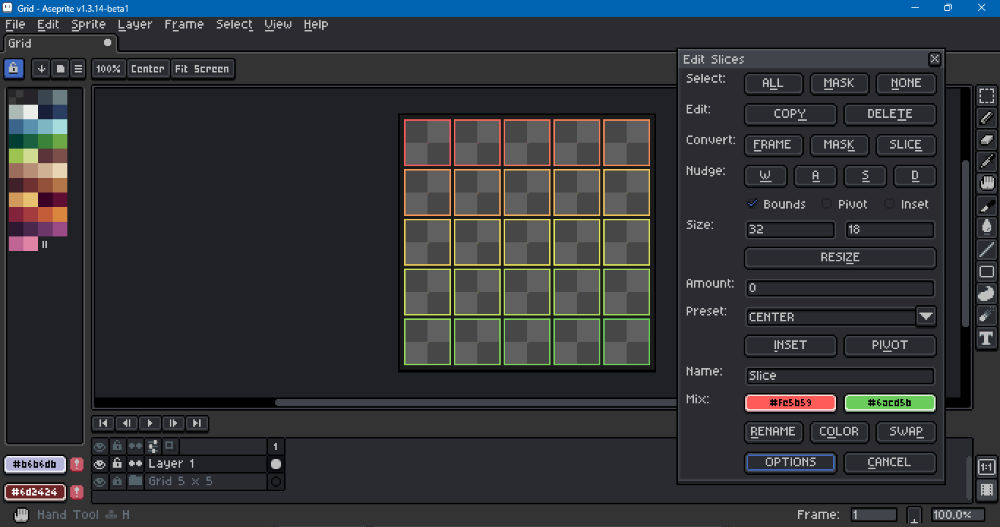
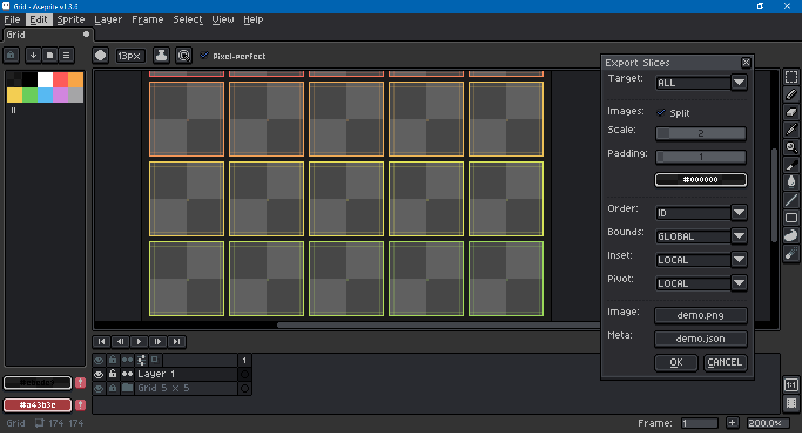

# Aseprite Slice Editor Tool



This is a tool to facilitate editing [9-slices](https://en.wikipedia.org/wiki/9-slice_scaling) within the [Aseprite](https://www.aseprite.org/) pixel art editor.

**The Aseprite slice feature has been buggy for a long time. In general, I discourage using slices. However, some people employ them regardless. Test this script on a sample sprite first. Backup any complex projects before including slices and/or using this script.**

If you are creating a custom [theme](https://aseprite.org/docs/extensions/themes/), and work with the slices that link `theme.xml` and `sheet.png`, beware of using this script's features.

If you are creating a sprite with many frames, and need slices to record frame references, this script will not help you. A slice's frame data appears in a JSON export, but cannot be accessed via Lua. New slices created by this script are created on frame 1. A `fromFrame` and `toFrame` are assigned to a new slice's `properties`. For more, see these forum threads: [1](https://community.aseprite.org/t/how-do-i-figure-out-which-frame-a-slice-is-on), [2](https://community.aseprite.org/t/problem-with-slices-when-adding-removing-frames), [3](https://community.aseprite.org/t/slices-are-buggy-when-edited-at-different-frames), [4](https://community.aseprite.org/t/is-there-a-way-to-slice-single-frames).

This script was created with Aseprite version 1.3.5 on Windows 10. In the screen shot above, the theme is default dark with 100% UI scaling and 200% screen scaling. Due to the size of the dialog, a theme with 100% scaling is recommended.

If you would like to report a problem with the script, please see this repo's Issues section. I make no assurances that I will be able to resolve any problems. If you would like more info on running Aseprite in debug mode, see the command line interface (CLI) [documentation](https://aseprite.org/docs/cli/#debug).

## Download

To download this script, click on the green Code button above, then select Download Zip. You can also click on the `editSlices.lua` file. Beware that some browsers will append a `.txt` file format extension to script files on download. Aseprite will not recognize the script until this is removed and the original `.lua` extension is used. There can also be issues with copying and pasting. Be sure to click on the Raw file button; do not copy the formatted code.

## Installation

To install this script, open Aseprite. In the menu bar, go to `File > Scripts > Open Scripts Folder`. Move the Lua script into the folder that opens. Return to Aseprite; go to `File > Scripts > Rescan Scripts Folder` (the default hotkey is `F5`). The script should now be listed under `File > Scripts`. Select `editSlices.lua` to launch the dialog.

If an error message in Aseprite's console appears, check if the script folder is on a file path that includes characters beyond [UTF-8](https://en.wikipedia.org/wiki/UTF-8), such as 'é' (e acute) or 'ö' (o umlaut).

## Usage

A hot key can be assigned to a script by going to `Edit > Keyboard Shortcuts`. The search input box in the top left of the shortcuts dialog can be used to locate the script by its file name.

Once open, holding down the `Alt` or `Option` key and pressing the underlined letter on a button will activate that button via keypress. For example, `Alt+C` will cancel the dialog. See the screen capture above.

### Edit Slices

The features of this dialog, per each button, are:
- **All**: Selects all the sprite's slices.
- **Mask**: Gets the slices entirely contained by the selection mask.
- **None**: Deselects all the sprite's slices.
- **Copy**: Partially copies the selected slices, avoiding custom user data and properties. Inverts the slices' colors. Warns before execution.
- **Delete**: Deletes the selected slices. Warns before execution.
- **Frame**: Creates multiple slices from the cels in the active frame.
- **Mask**: Creates a slice from a selection mask.
- **Slice**: Creates a selection mask from a slice.
- **W**: Nudges the selected slices up toward y = 0.
- **A**: Nudges the selected slices left toward x = 0.
- **S**: Nudges the selected slices down toward y = height - 1.
- **D**: Nudges the selected slices right toward x = width - 1.
- **Resize**: Sets slices' bounds to the given size, maintaining their pivots. Insets are scaled by ratio of new size to old.
- **Inset**: Sets slices' insets to a pixel increment from its bounds.
- **Pivot**: Sets slices' pivots according to 9 presets (top left, bottom right, center, etc.).
- **Rename**: Sets a slice's name to the provided string. If multiple slices are selected, appends a number after the string.
- **Color**: Recolors the selected slices per a mix between two given colors. Color mixing is done in HSL unless one of the colors is gray. When HSL is used, the hue is mixed counter clockwise.
- **Swap**: Swaps the origin and destination color.
- **Cancel**: Closes the dialog.

Both resize and nudge try to avoid creating a slice that is outside the sprite's bounds.

All nudge buttons try to match the slice's top-left corner to the slice grid when snap to grid is enabled.

To nudge a slice inset or pivot, check the appropriate boxes beneath the WASD keys. Pivots may go outside the slice's bounds; insets may not.

Order-sensitive functions, like rename and color mix, sort slices according to the y coordinate, followed by the x, followed by the slice name. The frame to slice conversion function sorts by a layer's local stack index, then by name.

### Export Slices



A custom export dialog exports slice data to a JSON file. A sample of the format is as follows:

```json
{
    "files": [
        {
            "frame": 0,
            "id": 1183714612564447149,
            "path": "path\\to\\demo_106d662b2557cfad_0.png"
        }
    ],
    "slices": [
        {
            "name": "Slice 0004",
            "color": {
                "r": 249,
                "g": 127,
                "b": 88,
                "a": 255
            },
            "data": null,
            "bounds": {
                "topLeft": {
                    "x": 211,
                    "y": 7
                },
                "size": {
                    "x": 64,
                    "y": 64
                }
            },
            "center": {
                "topLeft": {
                    "x": 4,
                    "y": 4
                },
                "size": {
                    "x": 56,
                    "y": 56
                }
            },
            "pivot": {
                "x": 32,
                "y": 32
            },
            "properties": {
                "id": 1183714612564447149
            }
        }
    ],
    "apiVersion": 27,
    "frameBaseIndex": 1,
    "padding": 1,
    "scale": 2,
    "space": {
        "bounds": "global",
        "center": "local",
        "pivot": "local"
    },
    "version": {
        "major": 1,
        "minor": 3,
        "patch": 6,
        "prerelease": "",
        "prNo": 0
    }
}
```

Aseprite does not assign a unique identifier to slices. This script attempts to provide one for each slice in its `properties` field if not already present. Slices are sorted according to this identifier. The file path includes the identifier in hexadecimal. In the example above, `1183714612564447149` may be used to match a slice to a file, where `106d662b2557cfad` is its hexadecimal representation.

Slice names cannot always be relied on as unique identifiers. Aseprite does no validation on strings provided to names. A name can be empty, can be a duplicate of another slice's name, or can include characters that would invalidate a file path were it included. This script performs no extra validation measures on slice names.

When present, custom user data is enclosed in quotation marks, `"`. No attempt is made to escape characters or otherwise validate the data.

As mentioned at the top, a slice may also have `fromFrame` and `toFrame` fields in its properties if it was created with the edit slices dialog. All frame indices begin at zero, not one. The sprite's `frameBaseIndex` is given at the bottom. As mentioned before, the Lua scripting API does not have access to internal slice frame data, so the data cannot be included.